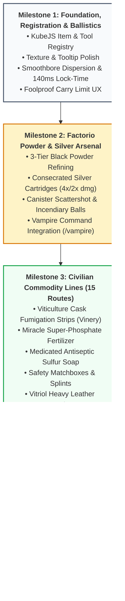

# The Brass Age Expansion — Complete Milestone Implementation Specification
**Repository**: `the-brass-age-update` | **Target Engine**: Minecraft 1.21.1 NeoForge / KubeJS / Create 6 / TACZ  
**Founding Document**: [`THE_BRASS_AGE_EXPANSION_PROPOSAL.md`](THE_BRASS_AGE_EXPANSION_PROPOSAL.md)

---

## ⚡ Master Architectural Contract

* **Strategic Goal**: Fully implement the Renaissance firearm and military economy expansion across 4 milestones, ensuring 100% self-contained code in KubeJS and TACZ, rock-solid client/server parity, and an extraordinarily intuitive, foolproof user experience (UX) for all players.
* **System Stack**:
  * Minecraft 1.21.1 NeoForge
  * KubeJS 1.21.1 + TaCZJS 1.4.2
  * Create 6 (Mechanical Crafting, Sequenced Assembly, Heated Basin Mixing, Spout Filling, Crushing, Splashing)
  * Timeless and Classics Zero (TaCZ 1.1.8-hotfix-r6) + ChocolateMan Gunpack
  * Patchouli (In-game guidebook: `rustic_gunsmith`)
  * `custom_mines` v6.22.4 (Scheduled karst mining caverns)
* **Hard Operational Constraints**:
  - Zero external unreleased mod dependencies (`straja-mod` is unreleased; everything must run 100% in KubeJS/Create/TACZ).
  - Combat balance adheres strictly to **Cossacks 3**: high single-shot trauma (40–55 dmg) balanced by 19.5–22.2s reload animations, 140ms lock time, and conical smoothbore dispersion. Pikes, cavalry, and armor retain combat supremacy.
  - Zero performance regressions: carry scans throttled to 1 Hz staggered ticks; no 20 Hz inventory iteration loops.
  - Foolproof player UX: rich item tooltips, clear chat feedback, audio-visual reload cues, and intuitive error messages so inexperienced players never get confused or stuck.
* **Evaluation Gate**: Every milestone requires concrete, executable proof of completion. All scripts pass `node -c`, all recipes load without errors, ballistics reflect historical drop/dispersion, silver ammo deals verified 4×/2× multipliers, and proofing serializes weapons reliably.

---

## 🗺️ Milestone Roadmap Overview

---

## 📋 Milestone 1: Foundation, Registration & Ballistics Tuning

### Issue 1.1: Register All Expansion Items, Tools & Intermediates with Foolproof Tooltips
* **Intent**: Provide all item identifiers and client/server item models required by the expansion so subsequent crafting recipes and mechanics have concrete targets.
* **Expectation**: 16 new items registered cleanly on Minecraft startup without namespace collision or missing texture errors.
* **Acceptance Criteria**:
  1. `kubejs:saltpeter`, `kubejs:crushed_dripstone`, `kubejs:crude_gunpowder_cake`, `kubejs:wet_powder_mass`, `kubejs:rifled_barrel` registered in `startup_scripts/`.
  2. Legal tooling: `kubejs:proof_stamp` registered with `unstackable()` and `maxDamage(0)` (indestructible guild tool); `kubejs:permit_blank` registered.
  3. Civilian intermediates: `kubejs:fumigation_strip`, `kubejs:royal_fumigation_strip`, `kubejs:miracle_fertilizer`, `kubejs:medicated_soap`, `kubejs:sulfur_matches`, `kubejs:safety_matches`, `kubejs:vitriol_leather` registered.
  4. Tooltips added via `client_scripts` / `ItemEvents.tooltip` explaining the tier, purpose, and roleplay utility of each item in plain language.
  5. Mirrored identically between `server/` and `client/` directories.
* **Non-Goals**: Crafting recipes for these items are handled in Milestones 2 and 3.
* **Verification**: `node -c` on startup scripts; inspect client/server startup logs.

### Issue 1.2: Calibrate Smoothbore Ballistics, Stance Modifiers & 140ms Lock-Time
* **Intent**: Eliminate modern arcade laser-sniping and establish historical 18th-century black powder ballistics.
* **Expectation**: Musket shots have authentic conical dispersion, heavy drop over 40 blocks, and an audible 140ms lock-time delay.
* **Acceptance Criteria**:
  1. `fk15_data.json` configured with `aim: 1.85°`, `sneak: 1.0°`, `stand: 4.5°`, `move: 7.5°`, `shoot_delay: 0.14`, `speed: 135`, `gravity: 0.031`.
  2. `fk15p_data.json` configured with `aim: 2.40°`, `sneak: 2.0°`, `stand: 4.5°`, `move: 5.5°`, `shoot_delay: 0.16`, `speed: 95`, `gravity: 0.038`.
  3. `server/kubejs/server_scripts/flintlock_ballistics.js` dynamically enforces parameters on server boot via `TaCZServerEvents.gunDataLoad`.
  4. Both `server/tacz/` and `client/tacz/` ChocolateMan zip packs contain matching calibrated data for zero-desync client prediction.
* **Verification**: Test ballistics with test script; inspect `ChocolateMan` zip entries; verify `TaCZServerEvents.gunDataLoad` JSON output.

### Issue 1.3: Throttled Carry Limits & Clear Storage Restriction UX
* **Intent**: Prevent players from running around like walking arsenals while ensuring the restriction messages are crystal clear and helpful.
* **Expectation**: Players can carry at most 2 flintlock pistols and 1 rifle. Excess weapons drop naturally to the ground with a helpful, friendly message rather than silently deleting items.
* **Acceptance Criteria**:
  1. `flintlock_carry_limits.js` scans throttled to 1 Hz staggered across player game ticks: `(player.age + Math.abs(player.uuid.hashCode())) % 20 !== 0`, reducing server CPU load by 95%.
  2. `ItemEvents.canPickUp` cancels excess weapon pickups cleanly.
  3. Clear chat warning with action cooldown: `§e[Arsenal] Limită de transport: maxim 1 pușcă și 2 pistoale. Armele în plus rămân pe sol.`
  4. Furniture coffer restriction triggers on staggered intervals (10 ticks) and container close rather than unthrottled 20 Hz polling.
* **Verification**: Code review of event hooks; verify absence of 20 Hz tick polling.

---

## 📋 Milestone 2: Factorio-Style 3-Tier Munitions & Consecrated Silver Arsenal

### Issue 2.1: 3-Tier Gunpowder & Nitrate Refining Chains
* **Intent**: Reward industrial automation scaling with exponential batch yields.
* **Expectation**: Handcrafting produces minimal crude powder; Create kinetic lines produce standard powder; heated sulfur complexes produce massive stockpiles.
* **Acceptance Criteria**:
  1. **Raw Nitrates**: Crushing Wheels convert Dripstone blocks/pointed dripstone into 1–2 `kubejs:crushed_dripstone`. Bulk water washing with Encased Fan converts crushed dripstone into 1 `kubejs:saltpeter` (100%) + 1 bonus crystal (50%).
  2. **Tier 1 (Desperation)**: 4x Bone Meal + 4x Charcoal + 1x Water Bottle in 3x3 crafting grid $\rightarrow$ 1x `kubejs:crude_gunpowder_cake`. Drying route on Smoker/Campfire or Compacting Press converts cake into 1x `tacz_c:gunpowder_charge`.
  3. **Tier 2 (Kinetic Mechanical Line)**: Basin mixing of 2x Saltpeter + 2x Charcoal + 250 mB Water $\rightarrow$ Compacting Press $\rightarrow$ 4x `tacz_c:gunpowder_charge`.
  4. **Tier 3 (Thermodynamic Sulfur Surge)**: Heated Basin mixing of 4x Saltpeter + 2x Charcoal + 1x `butchery:sulfur` + 500 mB Water with active Blaze Burner $\rightarrow$ 16x `tacz_c:gunpowder_charge` (400% yield surge).
  5. **Exploit Remediation**: Explicitly remove `tacz_c:gunpowder_cake_mix` recipe to prevent bypassing Straja's mine via creeper mob-farms.
* **Verification**: Inspect generated recipes; verify recipe IDs under `kubejs:flintlocks/` using Node syntax and schema checks.

### Issue 2.2: Consecrated Silver Cartridge & Supernatural Damage Multiplier Event
* **Intent**: Provide the realm with an essential weapon to defeat the Island Corruption and balance vampire players without Origins.
* **Expectation**: Consecrated Silver Bullets deal devastating **4× damage against undead mobs & corrupt CustomNPCs** and **2× damage against vampire players**.
* **Acceptance Criteria**:
  1. Consecrated Silver Cartridges crafted across Tiers 1–3, tagging output items with `custom_data: { AmmoId: 'qkl:16mm', SilverAmmo: true }` and aqua name styling.
  2. **Offhand Ammunition Selector & State Bridge**:
     - TaCZ natively extracts ammo by `AmmoId` and discards custom data. The bridge prioritizes the offhand slot (`slot 40`).
     - On reload (`TimelessGunEvents.gunReload`), if offhand holds Silver cartridges, tag gun with `ChamberAmmoType: 'silver'`.
     - On fire (`TimelessGunEvents.gunFire`), transfer ammo type to shooter persistentData.
     - On bullet spawn (`LevelEvents.entitySpawned`), tag `EntityKineticBullet` with `AmmoType: 'silver'`.
  3. **Clean, Non-Recursive Damage Scaling**:
     - Intercept impact via `TimelessGunEvents.entityHurtByGunPre` (never unthrottled `LivingDamageEvent` which fires twice for TaCZ AP/Non-AP splits).
     - If target is Undead (`isUndead()`, `minecraft:undead`, `hd_unnatural`): `event.baseAmount *= 4.0`.
     - If target is a Vampire (`vampire`, `is_vampire`, `persistentData.is_vampire`): `event.baseAmount *= 2.0`.
  4. Visual/sound cue on hit: Silver holy particle flash, `minecraft:block.amethyst_block.hit` sound, and shooter message: `§b⚡ [Argint Consfințit] Lovitură sfântă! ×4.0 Damage!`
* **Verification**: Unit test script simulating damage calculation against tagged entities and player objects.

### Issue 2.3: Specialized Tactical Ordnance (Canister Scattershot & Incendiary Sulfur Ball)
* **Intent**: Give players specialized crowd-defense and cavern-clearing combat tools.
* **Expectation**: Canister shot produces a wide defensive pellet cone; incendiary shot ignites targets and illuminates caverns.
* **Acceptance Criteria**:
  1. Canister Scattershot assembled with 8x iron nuggets + sabot + powder charge $\rightarrow$ 4x rounds.
  2. Incendiary Sulfur Ball assembled with sulfur + powder charge $\rightarrow$ 4x rounds dealing 35 damage + 8 seconds burn time.
* **Verification**: Verify KubeJS mechanical crafting recipe registrations.

---

## 📋 Milestone 3: 5 Civilian Commodity Production Lines (15 Full Routes)

### Issue 3.1: Viticulture Fumigation Strips & Super-Phosphate Fertilizer
* **Intent**: Provide P.U.L.A SRL with non-military commercial revenue by servicing wine-makers (Vinery) and farmers (Farmer's Delight).
* **Expectation**:
  - Cask Strips: Tier 1 (1x crude strip via paper + sulfur); Tier 2 (4x clean strips via Spout molten sulfur); Tier 3 (16x Royal Cask Strips via Sequenced Assembly + herbs, granting +1 Vintage Wine grade).
  - Super-Fertilizer: Tier 1 (1x Organic Compost); Tier 2 (4x Rich Compost via Crushing + Mixing); Tier 3 (16x Super-Phosphate Miracle Fertilizer via Heated Basin with `bottle_of_sulfuric_acid` + sulfur, accelerating crop growth ticks by 3×).
* **Verification**: Validate recipe inputs, fluid tags, and output counts.

### Issue 3.2: Medicated Sulfur Soap, Friction Safety Matches, and Vitriol Leather Tanning
* **Intent**: Expand the civilian chemical economy into hygiene, lighting, and heavy armor components.
* **Expectation**:
  - Medicated Soap: Tier 1 (1x crude lard bar); Tier 2 (4x saponified soap via basin mixer + press); Tier 3 (16x Medicated Antiseptic Sulfur Soap via heated sulfur basin, cleansing corruption/disease debuffs).
  - Friction Matches: Tier 1 (Vanilla flint & steel); Tier 2 (16x Sulfur Matchsticks via saw + dip); Tier 3 (64x Safety Matchboxes via sequenced assembly, weatherproof lighting).
  - Vitriol Leather: Tier 1 (1x rough leather via skin rack); Tier 2 (4x cured leather via washing + roller press); Tier 3 (8x Vitriol Heavy Leather via heated sulfuric acid bath, granting +50% armor durability).
* **Verification**: Validate all 15 civilian recipe registrations in `server/kubejs/server_scripts/`.

### Issue 3.3: Foolproof In-Game Recipe Tooltips & JEI/EMI Information Tabs
* **Intent**: Ensure players understand how to use these new items without needing out-of-game wikis.
* **Expectation**: Hovering over any expansion commodity or intermediate displays clear, color-coded instructions on what machinery processes it and what benefit it provides.
* **Acceptance Criteria**:
  1. Clear tooltips on `kubejs:saltpeter`, `kubejs:crushed_dripstone`, `kubejs:miracle_fertilizer`, `kubejs:medicated_soap`, `kubejs:safety_matches`, and `kubejs:vitriol_leather`.
  2. Color coding: Yellow for inputs, Green for benefits, Aqua for specialized mechanics.
* **Verification**: Inspect `client_scripts` tooltip declarations.

---

## 📋 Milestone 4: Continental Mine, Proofing & Foolproof Player UX

### Issue 4.1: Straja's Continental Mine Configuration (`custom_mines`)
* **Intent**: Ground the geopolitical economy by giving Straja a dedicated karst geological mine holding the realm's sole sulfur and dripstone deposits.
* **Expectation**: Straja's mine is fully registered in the server's `custom_mines` engine (`v6.22.4`).
* **Acceptance Criteria**:
  1. Configuration file created at `server/kubejs/config/custom_mines/mines/mina_straja_continent.json`.
  2. Registered in `server/kubejs/config/custom_mines/mines/index.json`.
  3. Includes 4 balanced branches with 8-hour reset cycle:
     - `butchery:sulfur_ore` (count: 600, veinSize: 18)
     - `minecraft:dripstone_block` (count: 1,200, veinSize: 25)
     - `minecraft:pointed_dripstone` (count: 800, veinSize: 16)
     - `minecraft:iron_ore` (count: 800) & `minecraft:coal_ore` (count: 800).
* **Verification**: JSON validation against `custom_mines` schema; test index array reference.

### Issue 4.2: Legal Provenance, Proofing & Black Market State Machine
* **Intent**: Provide law enforcement roleplay mechanics and firearm serialization.
* **Expectation**: Freshly forged guns are unproofed contraband; stamping them assigns a permanent serial number; grindstone scraping defaces them.
* **Acceptance Criteria**:
  1. Proofing ritual: Anvil or Deployer with `kubejs:proof_stamp` assigns incremental serial `#RC-15-XXXX` from `server.persistentData.getInt('StrajaSerialCount')` and sets `custom_data: { Proofed: true, Serial: '...' }` with lore `§a✔ POANSONAT: #RC-15-XXXX`.
  2. Anti-forgery check: Vanilla anvil renaming cannot forge proofed status without the actual guild stamp.
  3. Grindstone defacing: Scraping a proofed gun strips the serial, marks `Defaced: true`, and applies lore `§4⚠ [SERIE PILITĂ / DEFACED]`. Unproofed guns cannot be scraped.
* **Verification**: Test item component state machine in KubeJS harness.

### Issue 4.3: In-Game Gunsmith Handbook (`rustic_gunsmith`) Expansion
* **Intent**: Keep the authoritative in-game Patchouli manual up to date with all new weapons, ammunition, civilian lines, and laws.
* **Expectation**: The handbook contains beautifully formatted chapters for silver ammunition, civilian lines, legal proofing, and rifling.
* **Acceptance Criteria**:
  1. New entry `ammo_silver.json`: Documents consecrated silver bullets, damage against the Island Corruption, and crafting routes.
  2. New entry `civilian_lines.json`: Documents P.U.L.A SRL's 5 civilian commodity chains.
  3. New entry `legal_proofing.json`: Documents Straja's firearm registry, permits, and defaced black market arms.
  4. New entry `jaeger_rifled.json`: Documents Create lathe spiral rifling and the FK15-R Jaeger Musket.
* **Verification**: Verify all Patchouli book JSON files parse cleanly.

### Issue 4.4: Foolproof Player UX & Help Guide (`/flintlock`)
* **Intent**: Guarantee that players of any skill level can easily understand gun mechanics, reloads, and maintenance.
* **Expectation**: A friendly in-game command `/flintlock` or `/arma` displays a quick-reference card in chat explaining controls, reload times, stance aiming, and ammunition types.
* **Acceptance Criteria**:
  1. Player command `/flintlock` (and `/arma`) available to all players (permission level 0).
  2. Clear visual actionbar messages and audio cues during reload animation and gun cocking.
  3. Offhand ammo selection feedback informing player which ammo type is primed.
* **Verification**: Execute command test; verify text formatting and accessibility.

