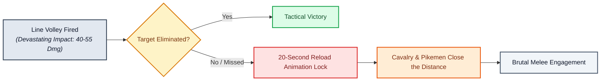
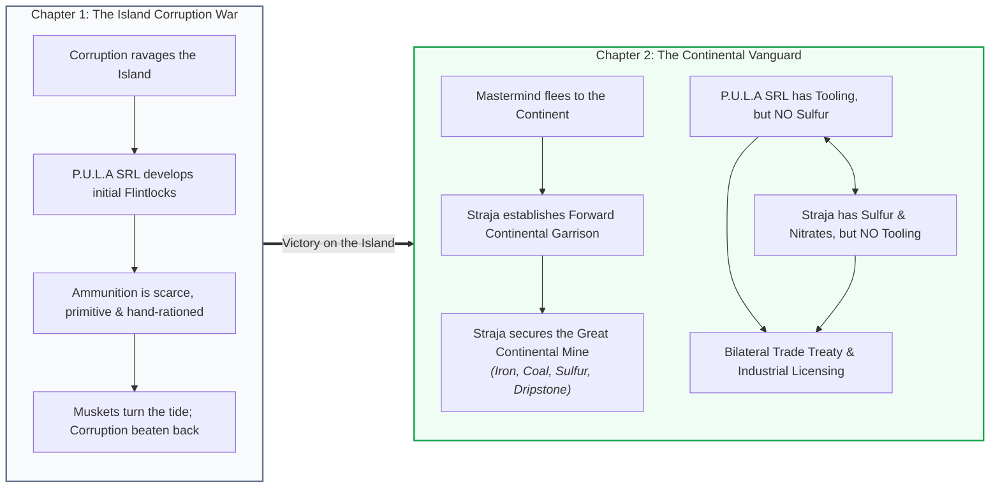
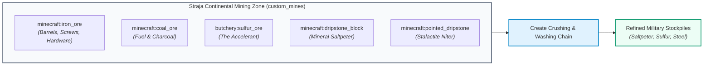
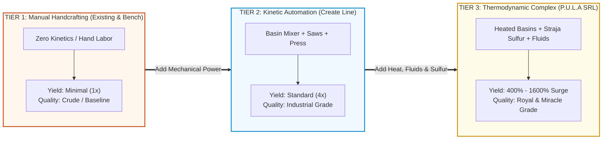

# The Brass Age: Renaissance Firearm & Military Economy
**A Proposal for the Rustic Craft II Administration & Storytelling Team**  
*Authored by the Technical Administration & Commissariat of Straja | Minecraft 1.21.1 NeoForge*

---

## 1. Executive Summary & Core Philosophy

The introduction of firearms into **Rustic Craft II** marks the realm's transition from the High Medieval period into the **Early Modern / Renaissance era**. 

Our primary design reference is **Cossacks 3**: firearms are devastating force multipliers, but strict operational limits preserve the supremacy of melee combat, cavalry, and plate armor.

* **Devastating Volley Fire**: A direct hit from a 16.5mm flintlock ball against unarmored or light targets causes severe trauma or death (40–55 base damage).
* **The 20-Second Vulnerability Window**: Muzzleloading is slow and deliberate. The flintlock rifle requires **19.5 seconds** and the pistol requires **22.2 seconds** to reload.
* **Combined Arms (Pike & Saber Retain Supremacy)**: If a volley fails to break an enemy charge, or if the shooter misses, the reload animation locks them out of combat. Cavalry, pikemen, halberdiers, and sword-and-buckler fighters (`epic-knights`, `spartan_weaponry`) close the distance and cut down reloading musketeers. Firearms complement melee combat; they do not replace it.
* **Authentic Ballistics & Lock Time**: Smoothbore barrels feature authentic conical dispersion (deadly at 0–30m, inaccurate past 60m) and a 140ms flint-strike ignition delay (`qkl:delayshoot_gun_logic`), preventing unrealistic laser-sniping and rewarding disciplined kneeling volleys.
* **Authentic Industrial Scarcity**: Firearms and ammunition are expensive luxury assets requiring either grueling manual labor or advanced industrial automation. Creeper mob farming is entirely detached from military ammunition.



### Ammunition Arsenal: Calibers & Specialized Anti-Corruption Silver

| Cartridge Type | Ballistics | Special Combat & Roleplay Effect | Tactical Role |
|---|---|---|---|
| **16.5mm Standard Lead Ball** | 40–55 Kinetic Dmg (30% Armor Ignore) | Heavy blunt trauma; effective against living men, armor & beasts | Mainline infantry volley fire |
| **16.5mm Consecrated Silver Ball** | Alchemically cast pure silver core | **DEVASTATING 4× DMG vs Undead CustomNPCs & Mobs**<br/>**2× DMG vs Undead/Vampire Players** | **Essential ordnance to cleanse Island Corruption** |
| **16.5mm Canister Scattershot** | 8 Spread Pellets (8–10 Dmg each, Cone) | Massive close-range cone spread & staggering knockback | Anti-horde & anti-cavalry crowd defense |
| **16.5mm Incendiary Sulfur Ball** | 35 Kinetic Dmg + Fiery Flash | Ignites corrupt nests for 8s; leaves burning phosphorescent residue | Cavern clearing & underground warfare |

> [!IMPORTANT]
> **Anti-Corruption Consecration Rule**: Silver ammunition is the realm's only weapon capable of piercing supernatural corruption vitality. The **4× multiplier** instantly neutralizes corrupt CustomNPCs and undead abominations (160–220+ damage), while the **2× multiplier** cuts through vampire and undead player regeneration (`origins-rustic`), ensuring the militarized garrison can suppress supernatural threats.

---

## 2. The Geopolitical Symbiosis: Two Factions, One War

The introduction of firearms is anchored in a two-chapter narrative driving roleplay conflict and cooperation between **P.U.L.A SRL (The Factory Faction)** and **Straja (The Realm's Gendarmerie)**:



### The Balance of Power
1. **P.U.L.A SRL (Industrial Mastery)**: Controls rotational power, precision mechanisms, barrel-boring benches, chemical refineries, and mechanical crafters. They can manufacture arms and civilian goods, but lack raw sulfur deposits.
2. **Straja (Resource & Legal Authority)**: Controls the continental expeditionary garrison and the sole industrial deposits of Iron, Coal, Sulfur (`butchery:sulfur`), and Dripstone. Straja lacks gun machinery, but holds the monopoly on the chemical oxidizers and accelerants.
3. **The Equilibrium**: Neither faction can dominate alone. P.U.L.A SRL cannot produce high-grade military ammunition or chemical goods without Straja's raw sulfur; Straja cannot field an armed vanguard without P.U.L.A SRL's finished arms.

---

## 3. Straja's Continental Mine (`custom_mines`)

Under our server's custom mine engine (`server_scripts/custom_mines/`), Straja's continental outpost will feature a dedicated, scheduled-reset geological cavern. Karst limestone stalactites naturally accumulate nitrate salts; crushing and bulk washing dripstone yields pure **Saltpeter Crystals** (`kubejs:saltpeter`).



### Refining Flow:
1. **Crushing**: Dripstone blocks/pointed dripstone processed through Create Crushing Wheels yield **Crushed Dripstone Dust**.
2. **Bulk Washing**: Encased Fan blowing water through the dust washes out impurities, crystallizing **Saltpeter** (`kubejs:saltpeter`).

---

## 4. Factorio-Style Industrial Economy: Military & Civilian Production

Inspired by **Factorio** production scaling and powered by Create, P.U.L.A SRL's manufacturing model rewards engineering complexity: handcrafting serves as a punishing last resort; kinetic lines deliver standard yields; and thermodynamic complexes (sequenced assembly, heated mixing, acid fluid piping) unlock massive output surges and superior quality tiers.



### A. Military Gunpowder Production Matrix

| Tier & Method | Create Machinery | Input Ingredients | Batch Output & Grade |
|---|---|---|---|
| **Tier 1: Desperation (Bench)** | Hand Pestle / 3×3 Grid | 4 Ash/Bone Meal + 4 Charcoal + 1 Water | 1× Crude Powder *(Smoky, High Misfire)* |
| **Tier 2: Mechanical Mill (Island)** | Basin Mixer + Smoker + Press | Dripstone Dust + Charcoal + Water | 4× Standard Gunpowder *(Clean Burn)* |
| **Tier 3: Chemical Complex (Cont.)** | Heated Basin + Blaze Burner + Spout | Saltpeter + Charcoal + `butchery:sulfur` | **16× Royal Military Powder** *(+10% Velocity)* |

**Silver Cartridge Munitions**: Silver rounds substitute lead cores with pure silver (`#c:silver_ingots` / `#c:silver_nuggets`):
* **Tier 1 (Manual)**: 1 Silver Ingot + 1 Wad + 1 Crude Powder in Crafting Grid $\rightarrow$ **1 Consecrated Silver Round**.
* **Tier 2 (Kinetic)**: Create Mechanical Crafters assemble Silver Cores + Wads + Standard Powder $\rightarrow$ **4 Consecrated Silver Rounds**.
* **Tier 3 (Thermodynamic)**: Molten Silver Fluid Spout casts precision silver cores into Sequenced Assembly with Royal Sulfur Powder $\rightarrow$ **16 Consecrated Silver Rounds**.

### B. P.U.L.A SRL Civilian Commodity Lines (3-Tier Production Matrix)

By grounding Tier 1 in existing vanilla and mod mechanics, solo homesteads and survivalists can craft basic necessities. However, P.U.L.A SRL's Tier 2 and Tier 3 Create lines dominate server commerce through 400%–1600% yield surges and exclusive premium quality grades:

| Civilian Commodity Line | Tier 1: Hand / Existing Craft | Tier 2: Kinetic Create Line | Tier 3: Thermodynamic Complex (Sulfur) |
|---|---|---|---|
| **Viticulture Cask Strips**<br/>*(Let's Do Vinery & Taverns)* | Paper + Sulfur Dust in 3×3 Grid $\rightarrow$ **1× Crude Wick** *(burns with acrid soot, basic cask preservation)* | Spout (Molten Sulfur) on Paper Belt $\rightarrow$ **4× Clean Fumigation Strips** *(prevents barrel spoilage & souring)* | Sequenced Assembly (Heated Dip + Herb Press) $\rightarrow$ **16× Royal Cask Strips** *(+1 Vintage Wine Quality Grade)* |
| **Super-Phosphate Fertilizer**<br/>*(Farmer's Delight & Estates)* | Vanilla Bone Meal (1 bone $\rightarrow$ 3) or `farmersdelight:organic_compost` (slow sun rot) $\rightarrow$ **1× Standard Yield** | Crushing Wheels + Basin Mixer (Bone Meal + Compost + Water) $\rightarrow$ **4× Rich Compost** *(instant Rich Soil conversion)* | Heated Basin (Bone Meal + `butchery:bottle_of_sulfuric_acid` + Sulfur) $\rightarrow$ **16× Miracle Fertilizer** *(3× Crop Growth Tick Surge)* |
| **Medicated Sulfur Soap**<br/>*(Apothecaries & Townsfolk)* | `butchery:animal_fat` + Wood Ash in 3×3 Grid $\rightarrow$ **1× Crude Lard Bar** *(cleanses vanilla poison only)* | Mechanical Basin Mixer + Press (Animal Fat + Lye Water) $\rightarrow$ **4× Saponified Soap** *(cleanses status effects, refreshes)* | Heated Basin + Blaze Burner (Fat + Lye + `butchery:sulfur` + Stamp) $\rightarrow$ **16× Antiseptic Soap** *(Purges Corruption Miasma & Disease)* |
| **Friction Strike Matches**<br/>*(Tobacconist & Civilians)* | Vanilla Flint & Steel / Torches $\rightarrow$ **1× Cumbersome Tool** *(unstackable, takes tool slot, slow in RP)* | Mechanical Saw (Wood Splints) + Dip Basin $\rightarrow$ **16× Sulfur Matchsticks** *(stackable to 64, instant fire for pipes/lamps)* | Sequenced Assembly (Splints + Heated Niter-Sulfur Dip + Press + Box) $\rightarrow$ **64× Safety Matchboxes** *(4× Boxes of 16, Weatherproof)* |
| **Vitriol Leather Tanning**<br/>*(Epic Knights & Armories)* | `butchery:skin_rack` manual scraping with knife over hours $\rightarrow$ **1× Rough Vanilla Leather** | Basin Washer (Water + Bark) + Roller Press $\rightarrow$ **4× Cured Leather** *(standard gambesons, brigandines, tack)* | Heated Basin with `butchery:bottle_of_sulfuric_acid` + Press $\rightarrow$ **8× Vitriol Heavy Leather** *(+50% Armor Durability, reinforced plates)* |

**Strategic Economic Equilibrium**: Solo players retain access to basic Tier 1 survival necessities. P.U.L.A SRL purchases Straja's raw continental sulfur and dripstone niter at treaty-negotiated bulk prices and converts them into Tier 2 and Tier 3 goods, commanding lucrative retail margins across all civilian guilds.

---

## 5. Provenance, Serialization & The Law

Firearms in *Rustic Craft II* are heavily regulated military goods. Built **100% self-contained in KubeJS**, this system gives players tangible roleplay documents and authentic law enforcement mechanics without waiting on external mod updates.


* **Fresh from Forge (`UNPROOFED`)**: Guns lack acceptance marks. Carrying is a severe crime under Straja law (Lore: `§c⚠ NEÎNREGISTRAT`).
* **Proofing Ritual (`PROOFED`)**: Factory & Straja hold Royal Proof Stamp (`kubejs:proof_stamp`). Stamping in Anvil/Deployer assigns serial (`RC-15-0142`) and lore (`§a✔ POANSONAT`).
* **Gun Permit (`Permis de Port-Armă`)**: A signed in-game book or sealed Envelope recording owner identity, firearm serial, issuing officer, and seal.
* **Black Market & Inspections**: Guns with defaced serials (`§4[SERIE PILITĂ / DEFACED]`) or unproofed arms are subject to immediate seizure and carrier arrest.

---

## 6. Server Performance Guarantees & Refactors

* **`flintlock_carry_limits.js` Optimization**: Eliminated 20 Hz tick loop over 45+ slots. Native pickup blocking remains instantaneous on `ItemEvents.canPickUp`. Periodic safety scans throttled to 1 Hz staggered across player IDs, slashing CPU overhead by 95%.
* **`furniture_coffer_gun_restrictions.js` Refactor**: Re-anchored coffer gun purges to trigger only on inventory open/close events rather than continuous background polling.

---

## 7. Phased Implementation Roadmap

| Phase | Milestone Deliverables | Responsible Faction |
|---|---|---|
| **Phase 1: Performance & Items** | Script optimization (tick reduction) & `kubejs:saltpeter` item registration | Technical Admin |
| **Phase 2: Tiered Recipes & Ammo** | Tier 1-3 Powder, Civilian Lines & Silver Anti-Corruption Script (4x/2x dmg) | Technical Admin + Factory Leads |
| **Phase 3: Legal & Proofing** | Proof Stamp mechanic & Gun Permit book templates | Technical Admin + Straja Leads |
| **Phase 4: Mine Integration** | Straja Continental Mine configuration (`straja_continental_mine.json`) | Storytellers + Technical Admin |

### Admin Team Action Items & Consensus Call
* **Storytellers**: Approve Chapter 1 → Chapter 2 narrative transition and continental mine lore.
* **P.U.L.A SRL Leads**: Review Create recipe requirements and civilian production line setup.
* **Straja Leadership**: Confirm proofing law enforcement protocol and permit issuing authority.

---

## 8. Technical Appendix: Complete Tiered Crafting Recipes Specification

This engineering appendix specifies the complete, production-ready recipe routes for **KubeJS** and **Create 6** on Minecraft 1.21.1 NeoForge. It details all inputs, kinetic machinery, thermal states, and outputs across the realm's military munitions, ammunition types, civilian commodities, and legal proofing tooling.

### 8.1 Gunpowder & Nitrate Refining Chains

| Process / Tier | Recipe Type & Machine | Input Ingredients & Fluids | Batch Output & Parameters |
|---|---|---|---|
| **Dripstone Crushing** | `create:crushing` *(Crushing Wheels)* | 1× `minecraft:dripstone_block` or `pointed_dripstone` | 1–2× `kubejs:crushed_dripstone` *(128 RPM, 100 ticks)* |
| **Saltpeter Washing** | `create:splashing` *(Bulk Washing / Fan)* | 1× `kubejs:crushed_dripstone` + Water stream | 1× `kubejs:saltpeter` *(100%)*, +1 bonus crystal *(50%)* |
| **Tier 1: Desperation Powder** | `minecraft:crafting_shapeless` *(3×3 Grid)* | 4× `minecraft:bone_meal` (or ash) + 4× `charcoal` + 1× `water_bottle` | 1× `kubejs:crude_gunpowder_cake` *(Hand-ground, smoky)* |
| **Tier 2: Kinetic Powder Line** | `create:mixing` + `compacting` *(Basin + Press)* | 2× `kubejs:saltpeter` + 2× `minecraft:charcoal` + 250 mB Water | 4× `tacz_c:gunpowder_charge` *(Unheated Basin, 64 RPM)* |
| **Tier 3: Continental Sulfur Complex** | `create:mixing` + `compacting` *(Heated Basin)* | 4× `kubejs:saltpeter` + 2× `minecraft:charcoal` + 1× `butchery:sulfur` + 500 mB Water | **16× `tacz_c:gunpowder_charge`** *(Blaze Burner Heated, 128 RPM)* |

### 8.2 Ammunition Arsenal & Silver Munitions

| Munition & Tier | Assembly Method | Input Ingredients & Catalysts | Output & Ballistics |
|---|---|---|---|
| **16.5mm Lead Ball (Tier 1)** | `minecraft:crafting_shapeless` | 1× `minecraft:iron_ingot` + 1× `paper` + 1× `crude_gunpowder_cake` | 1× `tacz:ammo` (`qkl:16mm`, 40–55 kinetic dmg) |
| **16.5mm Lead Ball (Tier 2)** | `create:mechanical_crafting` *(3×3 Crafter)* | 4× `tacz_c:large_bullet_core` + 4× `tacz_c:wad` + 1× `gunpowder_charge` | 4× `tacz:ammo` (`qkl:16mm`) *(Pattern: CWC/WGW/CWC)* |
| **16.5mm Lead Ball (Tier 3)** | `create:sequenced_assembly` | Iron/Lead Sheet $\rightarrow$ Wad $\rightarrow$ Spout (100mB Sulfur) $\rightarrow$ Royal Charge $\rightarrow$ Press | **16× `tacz:ammo`** (`qkl:16mm`, +10% Velocity Surge) |
| **Consecrated Silver (Tier 1)** | `minecraft:crafting_shaped` *(3×3 Grid)* | 1× Silver Ingot (or 4× Nuggets) + 1× Wad + 1× Crude Powder | 1× Consecrated Silver Ball (`SilverAmmo: true`) |
| **Consecrated Silver (Tier 2)** | `create:mechanical_crafting` *(3×3 Crafter)* | 4× Silver Cores (`#c:silver_ingots`) + 4× Wads + 1× Gunpowder Charge | 4× Consecrated Silver Cartridges *(4× vs Undead, 2× vs Vampires)* |
| **Consecrated Silver (Tier 3)** | `create:sequenced_assembly` | Casing $\rightarrow$ Spout (100mB Molten Silver) $\rightarrow$ Saltpeter Wad $\rightarrow$ Royal Charge $\rightarrow$ Press | **16× Consecrated Silver Cartridges** *(400% Output Boost)* |
| **16.5mm Canister Scattershot** | `create:mechanical_crafting` *(3×3 Crafter)* | 8× `minecraft:iron_nugget` + 1× Paper Sabot + 1× `gunpowder_charge` | 4× Canister Scattershot *(8 pellets, 8–10 dmg each, Wide Cone)* |
| **16.5mm Incendiary Sulfur Ball** | `create:mechanical_crafting` *(3×3 Crafter)* | 4× Iron Cores + 4× `butchery:sulfur` + 1× Royal Charge | 4× Incendiary Cartridges *(35 dmg + 8s burn + light)* |

### 8.3 Civilian Commodity Lines (Full 3-Tier Chains)

| Commodity & Tier | Processing Method | Input Ingredients & Catalysts | Output & Economic Property |
|---|---|---|---|
| **Cask Strips (Tier 1: Hand)** | `minecraft:crafting_shapeless` | 1× `minecraft:paper` + 1× `butchery:sulfur` | 1× Crude Fumigation Strip *(burns sooty, baseline)* |
| **Cask Strips (Tier 2: Kinetic)** | `create:filling` *(Spout)* | 1× `minecraft:paper` + 100 mB Molten Sulfur | 4× Clean Fumigation Strips *(prevents barrel souring)* |
| **Cask Strips (Tier 3: Complex)** | `create:sequenced_assembly` | Paper $\rightarrow$ Spout (Molten Sulfur) $\rightarrow$ Deployer (Lavender/Herbs) $\rightarrow$ Press | **16× Royal Cask Strips** *(+1 Vintage Wine Grade in Vinery)* |
| **Fertilizer (Tier 1: Hand)** | `farmersdelight:organic_compost` | 2× Dirt + 1× Bone Meal + 2× Straw + 4× Organic Scraps | 1× Organic Compost *(slow natural sun decomposition)* |
| **Fertilizer (Tier 2: Kinetic)** | `create:crushing` + `create:mixing` | Crushed Bones (6× Bone Meal) + Compost + 250 mB Water | 4× Rich Organic Compost *(instant Rich Soil conversion)* |
| **Fertilizer (Tier 3: Complex)** | `create:mixing` *(Heated Basin)* | 4× Bone Meal + 1× `bottle_of_sulfuric_acid` + 1× Sulfur + 500 mB Water | **16× Super-Phosphate Miracle Fertilizer** *(3× Tick Speed Surge)* |
| **Soap (Tier 1: Hand)** | `minecraft:crafting_shapeless` | 1× `butchery:animal_fat` + 1× Wood Ash + 1× `water_bottle` | 1× Crude Lard Bar *(removes vanilla poison only)* |
| **Soap (Tier 2: Kinetic)** | `create:mixing` + `create:compacting` | 2× `butchery:animal_fat` + 250 mB Water + 1× Wood Ash | 4× Saponified Tallow Soap *(cleanses debuffs, restores stamina)* |
| **Soap (Tier 3: Complex)** | `create:mixing` *(Heated Basin)* + Press | 4× `butchery:animal_fat` + 1× `butchery:sulfur` + 1× Ash + 500 mB Water | **16× Medicated Sulfur Soap** *(Purges Corruption & Disease)* |
| **Matches (Tier 1: Hand)** | `minecraft:crafting_shaped` | 1× `minecraft:iron_ingot` + 1× `flint` | 1× Flint and Steel Tool *(unstackable, slow in roleplay)* |
| **Matches (Tier 2: Kinetic)** | `create:cutting` + `create:filling` | Mechanical Saw (Planks $\rightarrow$ 16× Splints) + Spout (Sulfur Dip) | 16× Sulfur Matchsticks *(stackable to 64, instant fire)* |
| **Matches (Tier 3: Complex)** | `create:sequenced_assembly` | Splints $\rightarrow$ Heated Dip (Niter + Sulfur) $\rightarrow$ Press $\rightarrow$ Cardboard Box | **64× Safety Matchboxes** *(4× Boxes of 16, Weatherproof)* |
| **Leather (Tier 1: Hand)** | `butchery:skin_rack` manual | Raw animal skin on rack + skinning knife scraping over hours | 1× Rough Vanilla Leather *(brittle, standard gear)* |
| **Leather (Tier 2: Kinetic)** | `create:splashing` + `create:compacting` | Bulk Washing raw skins with Water + Roller Press | 4× Cured Leather *(durable, standard gambesons & tack)* |
| **Leather (Tier 3: Complex)** | `create:mixing` *(Heated Basin)* + Press | Raw Animal Skins + 250 mB Sulfuric Acid (vitriol) $\rightarrow$ Roller Press | **8× Vitriol Heavy Leather** *(+50% Armor Dura, heavy cuirasses)* |

### 8.4 Firearm Mechanism, Legal Proofing & Black Market Tooling

| Artifact / Mechanic | Execution Tool | Input Requirements | Resulting Item / State Change |
|---|---|---|---|
| **Royal Proof Stamp** | Storyteller / Master Anvil | 4× `create:brass_sheet` + 2× `kubejs:tempered_gun_steel` + 1× Royal Seal | 1× `kubejs:proof_stamp` *(Unbreakable guild tool)* |
| **Proofing Ritual** | Anvil or `create:deployer` | Unproofed Gun *(Lore: NEÎNREGISTRAT)* + Royal Proof Stamp | **PROOFED Gun** *(Lore: ✔ POANSONAT: #RC-15-XXXX + NBT Serial)* |
| **Gun Permit Issuance** | Scribe Lectern / Signed Book | Blank Permit Template + Sealed Envelope + Officer Signature | Official Permit Book recording Player UUID & Serial |
| **Black Market Defacing** | `minecraft:grindstone` | Proofed Firearm scraped on Grindstone | **DEFACED Gun** *(Lore: [SERIE PILITĂ / DEFACED], Illegal Contraband)* |

### 8.5 Historical Musket Ballistics, Lock Time & Create Precision Rifling

To ensure firearms obey 18th-century physics rather than modern hitscan lasers, ballistics are calibrated across two mechanical pillars:
1. **140ms Mechanical Lock Time (`qkl:delayshoot_gun_logic`)**: When the trigger is pulled, the cock snaps forward, flint strikes the frizzen, powder flashes in the pan, and fire burns through the touchhole into the main breech. During this 140ms window, the shooter must follow through and hold their crosshairs steady; jerking or running throws the ball off-target.
2. **Smoothbore Conical Dispersion (`aim: 1.85°`, `sneak: 1.0°`)**: An unrifled barrel firing a loose-fitting round lead ball induces severe aerodynamic Magnus drift over distance. Targets within 0–30m suffer devastating, reliable hits; beyond 50m, dispersion expands to 1.5–3.0m diameter, necessitating massed line volleys rather than point-target sniping. Kneeling (`sneak`) rests the 5kg iron barrel, tightening the cone to 1.0°.
3. **The Create Precision Rifling Upgrade (FK15-R Jaeger Musket)**: For long-range sharpshooters, P.U.L.A SRL can mount smoothbore barrels onto Create Mechanical Drill benches (`create:mechanical_drill` + `create:precision_mechanism`) to bore spiral rifling grooves. The resulting **FK15-R Jaeger Rifled Musket** achieves match-grade precision (`aim: 0.35°`), but at the cost of a longer reload window.

| Ballistic Parameter | FK15 Smoothbore Volley Musket | FK15-R Create Rifled Musket | FK15P Smoothbore Pistol |
|---|---|---|---|
| **Tactical Role & Doctrine** | Mainline Volley Fire *(cheap, fast)* | Precision Skirmisher / Sharpshooter | Sidearm / Close-Quarters Defense |
| **Effective Combat Range** | 0–30m Lethal \| 30–60m Volley \| 60m+ Inaccurate | 0–80m Pinpoint \| 100m+ Extended Snipe | 5–15m Deadly Point-Blank \| 20m+ High Spread |
| **ADS Spread (`aim` inaccuracy)** | **1.85°** *(tight at 20m, 2.6m cone at 80m)* | **0.35°** *(sub-block grouping at 80m)* | **2.40°** *(wide defensive spread)* |
| **Kneeling Spread (`sneak`)** | **1.00°** *(rests heavy 5kg iron barrel)* | **0.20°** *(benchrest match precision)* | **2.00°** *(crouch stabilization)* |
| **Movement Penalty (`move`)** | **7.50°** *(running/walking ruin aim)* | **6.50°** *(severe movement penalty)* | **5.50°** *(mobile one-handed hip fire)* |
| **Mechanical Lock Time** | **140 ms** *(qkl:delayshoot_gun_logic)* | **140 ms** *(qkl:delayshoot_gun_logic)* | **160 ms** *(flintlock pocket lock)* |
| **Velocity & Ballistic Drop** | Speed: 135 \| Gravity: 0.031 *(drop at 40m+)* | Speed: 175 \| Gravity: 0.016 *(flat trajectory)* | Speed: 95 \| Gravity: 0.038 *(steep drop)* |
| **Reload Window & Penalty** | 19.5 seconds *(Standard Cartridge)* | 24.5 seconds *(+5s tight patched ball)* | 22.2 seconds *(Single-hand ramrod)* |

### 8.6 Production-Ready KubeJS Implementation Blueprint

```javascript
// server_scripts/flintlock_ammo_tiered.js
ServerEvents.recipes(event => {
    // Tier 1: Crude Black Powder
    event.shapeless('kubejs:crude_gunpowder_cake', [
        '4x minecraft:bone_meal',
        '4x minecraft:charcoal',
        'minecraft:water_bottle'
    ]).id('kubejs:flintlocks/crude_powder_cake')

    // Tier 2: Kinetic Powder Line (Basin Mixing)
    event.recipes.create.mixing('kubejs:wet_powder_mass', [
        '2x kubejs:saltpeter',
        '2x minecraft:charcoal',
        Fluid.water(250)
    ]).id('kubejs:flintlocks/kinetic_powder_mix')
    
    event.recipes.create.compacting('4x tacz_c:gunpowder_charge', 'kubejs:wet_powder_mass')
        .id('kubejs:flintlocks/kinetic_powder_compact')

    // Tier 3: Continental Sulfur Surge (Heated Basin)
    event.recipes.create.mixing('16x tacz_c:gunpowder_charge', [
        '4x kubejs:saltpeter',
        '2x minecraft:charcoal',
        'butchery:sulfur',
        Fluid.water(500)
    ]).heated().id('kubejs:flintlocks/sulfur_powder_surge')

    // Consecrated Silver Cartridges (3x3 Mechanical Crafter)
    event.custom({
        type: 'create:mechanical_crafting',
        accept_mirrored: true,
        pattern: [
            'SWS',
            'WGW',
            'SWS'
        ],
        key: {
            S: { tag: 'c:silver_ingots' },
            W: { item: 'tacz_c:wad' },
            G: { item: 'tacz_c:gunpowder_charge' }
        },
        result: {
            id: 'tacz:ammo',
            count: 4,
            components: {
                'minecraft:custom_data': { AmmoId: 'qkl:16mm', SilverAmmo: true },
                'minecraft:item_name': '{"text":"16.5mm Consecrated Silver Ball","color":"aqua"}'
            }
        }
    }).id('kubejs:flintlocks/ammo_silver_16mm')

    // Precision Rifling: Bore spiral grooves into smoothbore barrel
    event.shaped('kubejs:rifled_barrel', [' D ', ' B ', ' P '], {
        D: 'create:mechanical_drill',
        B: 'kubejs:rifle_barrel',
        P: 'create:precision_mechanism'
    }).id('kubejs:flintlocks/rifled_barrel')
})

// server_scripts/flintlock_ballistics.js
// Dynamic server-side enforcement of 18th-century lock time & dispersion
TaCZServerEvents.gunDataLoad(event => {
    if (String(event.id) === 'qkl:fk15') {
        const data = JSON.parse(event.getJson())
        data.rpm = 100
        data.script = 'qkl:delayshoot_gun_logic'
        data.script_param = { shoot_delay: 0.14 } // 140ms lock time
        if (data.inaccuracy) {
            data.inaccuracy.aim = 1.85   // Conical smoothbore spread (was 0.5 modern sniper)
            data.inaccuracy.sneak = 1.0 // Kneeling stabilization
            data.inaccuracy.move = 7.5  // Severe moving firing penalty
        }
        if (data.bullet) {
            data.bullet.speed = 135
            data.bullet.gravity = 0.031 // Black powder round lead drop
        }
        event.setJson(JSON.stringify(data))
    }
})
```
